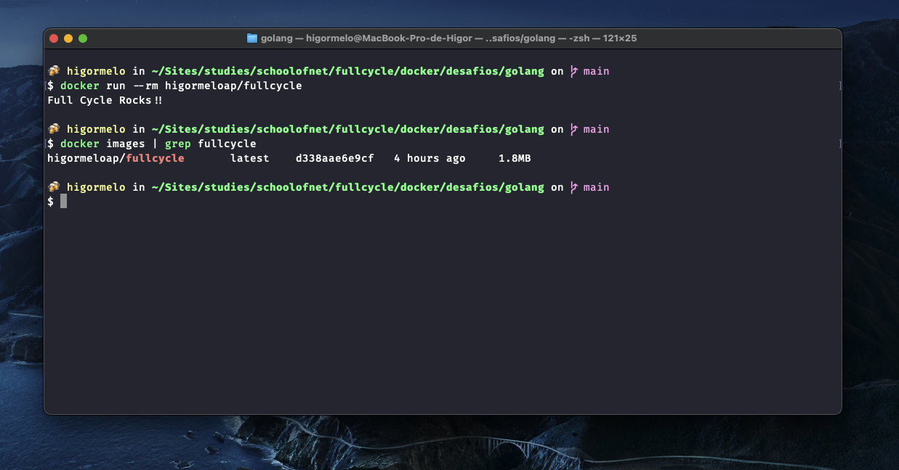

Desafio Go: https://github.com/higormeloap89/desafio-go-docker



## How to run

```bash
  # run docker image
  docker run --rm higormeloap/golang

  # show docker image size
  docker image ls | grep higormeloap
```

## Informações do desafio

Esse desafio é muito empolgante principalmente se você nunca trabalhou com a linguagem Go!

1) Você terá que publicar uma imagem no docker hub. Quando executarmos:

```bash
docker run <seu-user>/golang
```
2) Temos que ter o seguinte resultado: ```Full Cycle Rocks!```

Se você perceber, essa imagem apenas realiza um print da mensagem como resultado final, logo, vale a pena dar uma conferida no próprio site da Go Lang para aprender como fazer um "Olá mundo".

Lembrando que a Go Lang possui imagens oficiais prontas, vale a pena consultar o Docker Hub.

3) A imagem de nosso projeto Go precisa ter menos de 2MB =)

Divirta-se